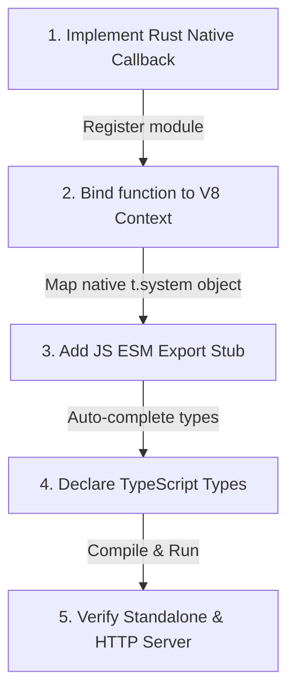

# Contributing to Titan Planet 🪐

First off, thank you for considering contributing to Titan Planet! It's because of passionate developers like you that Titan Planet can serve as a robust, native-performance backend for modern applications.

Titan Planet is a monorepo leveraging **npm workspaces** for JavaScript packages and **Cargo** for its high-performance, V8-embedded Rust runtime (`gravity`) and HTTP router (`orbit`).

---

## 📁 Repository Directory Structure

Before making any changes, it is helpful to understand where different components live:

```
titanpl/
├── gravity/                     # 🦀 Standalone Rust V8 Runtime (Gravity Crate)
│   ├── Cargo.toml               # Cargo package configuration
│   └── src/                     
│       ├── main.rs              # Gravity CLI entrypoint (builds tgrv.exe)
│       ├── runtime.rs           # V8 Isolate pool & Drift scheduler
│       ├── utils.rs             # Terminal logs styling & formatting
│       └── extensions/          # Native V8 Extensions & Bindings
│           ├── mod.rs           # Bootstraps V8 isolate global object & bindings
│           ├── titan_core.js    # 🟨 JS Core Bootstrap loaded into every isolate
│           └── builtins/        # Rust implementations of standard APIs
│               ├── mod.rs       # Exposes & mounts standard Rust APIs to JS
│               ├── db.rs        # PostgreSQL prepared query bindings
│               ├── fs.rs        # Sandboxed Async/Sync filesystem operations
│               ├── jwt.rs       # Native JWT sign & verify
│               ├── password.rs  # Native Bcrypt hashing
│               └── task.rs      # Managed background task scheduler
│
├── engine/                      # 🦀 Production HTTP Server & Action Router (Titan Server Crate)
│   ├── Cargo.toml               # Cargo package configuration (depends on 'gravity')
│   └── src/
│       ├── main.rs              # Axum HTTP server, router boot, & WebSocket upgrade handler
│       ├── action_management.rs # Dynamic route scanner, file watchers, & route resolver
│       └── fast_path.rs         # Zero-overhead response caching bypass for static paths
│
├── packages/                    # 📦 JavaScript & Native Packages (npm Workspaces)
│   ├── cli/                     # Developer CLI tool (`titan dev`, `titan build`)
│   ├── packet/                  # Packager & esbuild bundling pipeline
│   ├── route/                   # Static route scanner & metadata compiler
│   ├── sdk/                     # Developer SDK helpers
│   └── native/                  # Public API wrapper & TypeScript declarations
│       ├── index.js             # ESM stub exports mapping imports to V8 globals
│       ├── index.d.ts           # Public module declaration types
│       └── t.native.d.ts        # Comprehensive framework-wide TypeScript types
│
├── test-apps/                   # 🧪 Example Apps for Manual/Local Testing
└── tests/                       # 🧪 Jest/Vitest Automated Test Suites
```

---

## 🏛️ Understanding the Dual-Crate Architecture

Titan Planet uses a high-performance separation of concerns between V8 execution and HTTP orchestration:

1. **`gravity` (The JS/V8 Sandbox)**: Contains the pure V8 runtime isolate management, garbage collection, and custom Rust-to-JS extension API bindings (like filesystem, passwords, and task schedules). It builds a utility CLI executable named `tgrv.exe` that executes individual Javascript actions standalone.
2. **`engine` (The HTTP/Axum Server)**: Imports `gravity` as a dependency. It spins up a multi-threaded Axum TCP web server, binds incoming HTTP requests, matches exact or wildcard paths, reads request headers/bodies, and forwards the arguments into `gravity`'s worker pool for execution. It builds `titan-server.exe` used in production.

---

## ⚡ Step-by-Step Blueprint: Adding a Native Feature from End-to-End

To illustrate how to add new capabilities, let's walk through implementing a native feature: **Adding a function `t.system.getMemoryUsage()`** that returns the system's available RAM in MB.



### Step 1: Implement the Rust Core logic (`gravity/src/extensions/builtins/system.rs`)
Open `gravity/src/extensions/builtins/system.rs` and add the native V8 callback function:

```rust
use sysinfo::{System, SystemExt}; // hypothetical system querying library

/// Native V8 binding: t.system.getMemoryUsage()
pub fn native_get_memory_usage(
    scope: &mut v8::HandleScope,
    args: v8::FunctionCallbackArguments,
    mut retval: v8::ReturnValue,
) {
    // 1. Fetch system details
    let mut sys = System::new_all();
    sys.refresh_all();
    let free_memory_mb = sys.free_memory() / 1024 / 1024; // MBs

    // 2. Wrap Rust value into a V8 Number type
    let v8_val = v8::Number::new(scope, free_memory_mb as f64);

    // 3. Send back to Javascript
    retval.set(v8_val.into());
}
```

### Step 2: Register & Bind in the V8 Context (`gravity/src/extensions/builtins/mod.rs`)
Now we bind our Rust callback to V8 inside `setup_native_utils` so that every worker isolate is loaded with the native command.

```rust
fn setup_native_utils(scope: &mut v8::HandleScope, t_obj: v8::Local<v8::Object>) {
    // ... Inside setup_native_utils ...

    // 1. Fetch or create a "system" namespace object inside the V8 scope
    let system_obj = v8::Object::new(scope);

    // 2. Create the V8 Function template mapped to our Rust function
    let mem_fn = v8::Function::new(scope, system::native_get_memory_usage).unwrap();
    let mem_key = v8_str(scope, "getMemoryUsage");

    // 3. Inject function into the "system" object
    system_obj.set(scope, mem_key.into(), mem_fn.into());

    // 4. Expose the "system" object onto the global "t" runtime namespace
    let system_key = v8_str(scope, "system");
    t_obj.set(scope, system_key.into(), system_obj.into());
}
```

### Step 3: Export in the SDK stubs (`packages/native/index.js`)
To allow developers to import your new namespace using ESM modules (`import { system } from "@titanpl/native"`), open `packages/native/index.js` and register the stub mapping:

```javascript
// Expose namespace from the global `t` object injected by V8
export const system = t.system;
```

### Step 4: Declare TypeScript definitions for Autosuggestions
We must provide typing metadata in both the NPM stub and the global namespace for compilation:

1. **Add to the NPM package exports stub** inside [packages/native/index.d.ts](file:///packages/native/index.d.ts):
```typescript
export interface SystemModule {
    /** Returns the available memory on the host system in Megabytes (MB). */
    getMemoryUsage(): number;
}

export const system: SystemModule;
```

2. **Add to the Global Namespace types** inside [packages/native/t.native.d.ts](file:///packages/native/t.native.d.ts) so it's fully typed when developers access `t.system.getMemoryUsage()`:
```typescript
declare global {
    interface TitanNamespace {
        system: {
            /** Returns the available memory on the host system in Megabytes (MB). */
            getMemoryUsage(): number;
        };
    }
}
```

---

## 🛠️ Compilation & Multi-Engine Verification

Verify the entire dual-crate stack compiles and executes correctly under both development and production runtime configurations.

### 1. Compile & Verify Standalone Runtime (`gravity`)
Change your directory to `gravity` and test compilation:
```powershell
cd gravity
cargo check
cargo build --release
```
Write a quick sandbox script (`test-mem.js`):
```javascript
import { log, system } from "@titanpl/native";
log("System Available Memory (MB):", system.getMemoryUsage());
```
Execute it with `tgrv`:
```powershell
.\target\release\tgrv.exe test-mem.js
```

### 2. Compile & Verify HTTP Production server (`engine`)
Verify that the `engine` matches the modified `gravity` crate and routes/compiles perfectly:
```powershell
cd ../engine
cargo check
cargo build --release
```
Run the compiled Axum HTTP router:
```powershell
.\target\release\titan-server.exe run ../test-apps/prod-test/dist
```

### 3. Run JS workspaces test suite
Ensure JavaScript workspace utilities run cleanly:
```powershell
cd ..
npm install
npm test
```

---

## 🚀 Pull Request Workflow

1. **Fork the repo** and create your feature branch from `main`.
2. **Implement changes** ensuring strict compliance with standard Rust formatting (`cargo fmt`).
3. **Write types and docs** ensuring both `index.d.ts` and `t.native.d.ts` have updated typings.
4. **Submit the PR** with a clear explanation of what was changed and the architectural design rationale.
